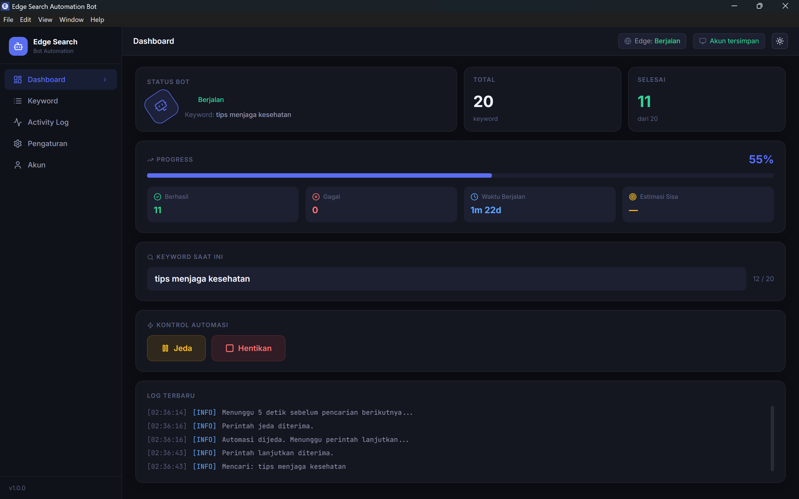
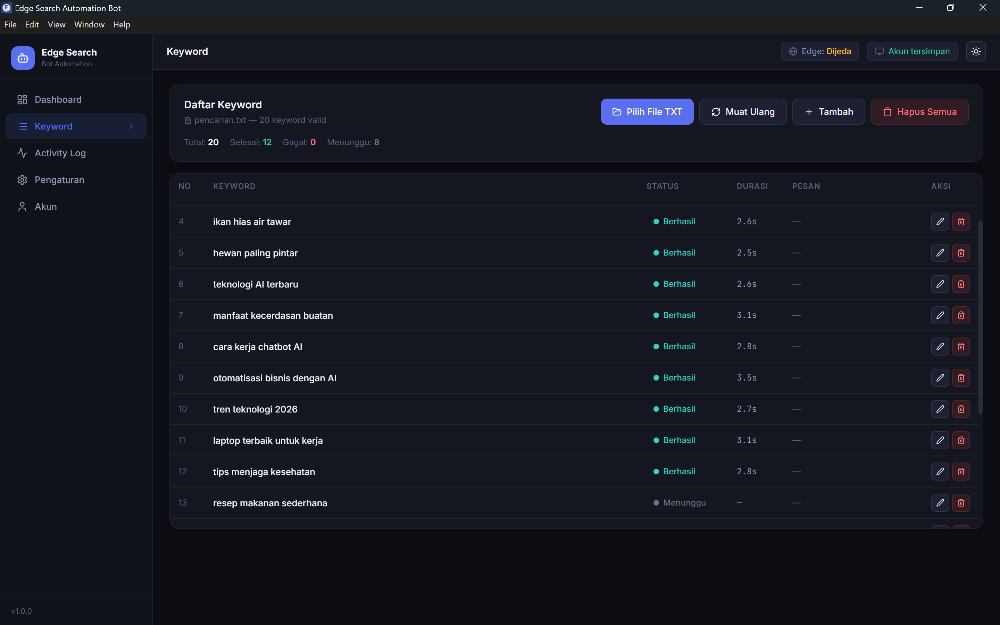
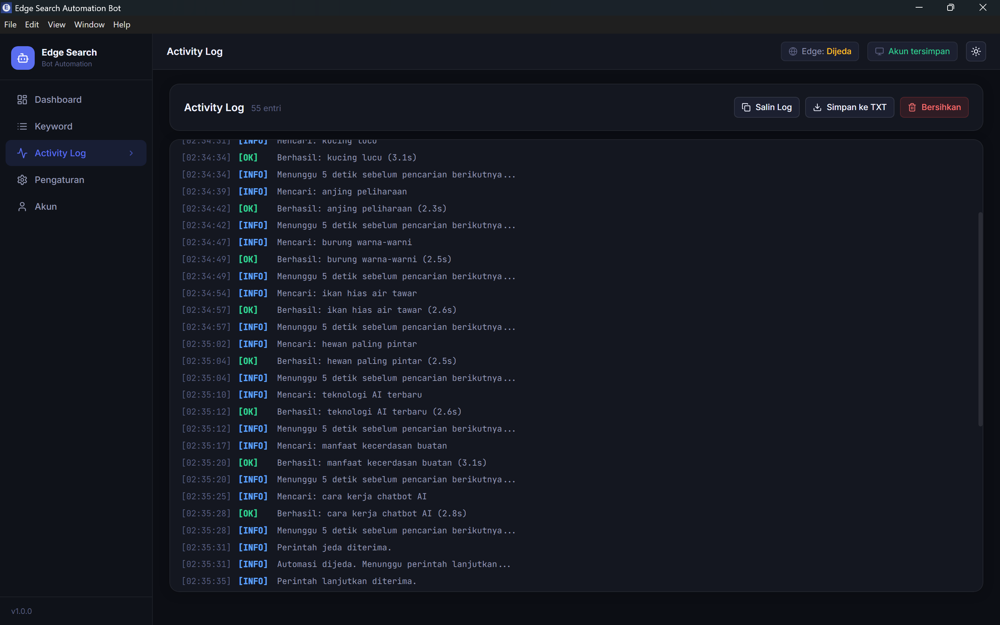
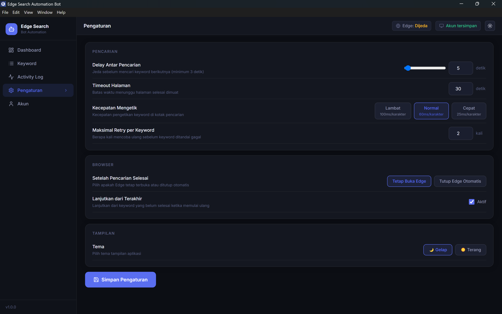
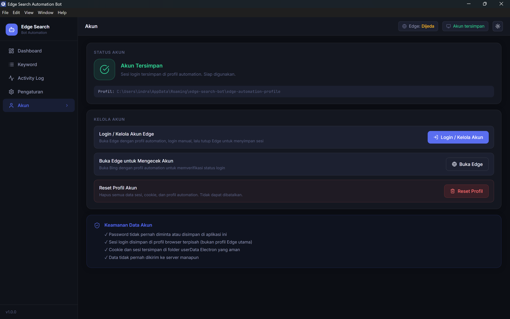
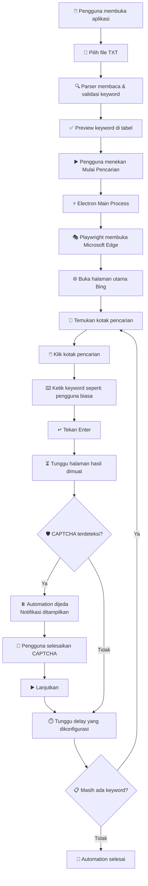
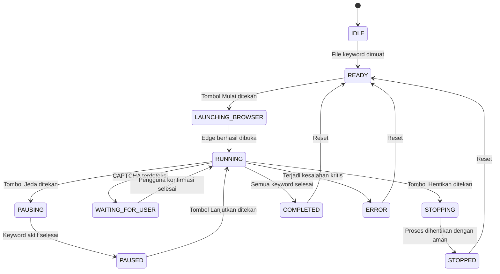

<div align="center">

# 🤖 Edge Search Automation Bot

**Otomatiskan pencarian Microsoft Edge dari satu file TXT melalui dashboard desktop yang modern, aman, dan mudah digunakan.**

---


---

</div>

## 📋 Daftar Isi

- [Overview](#-overview)
- [Preview Aplikasi](#-preview-aplikasi)
- [Fitur Utama](#-fitur-utama)
- [Cara Kerja](#-cara-kerja)
- [Arsitektur Aplikasi](#-arsitektur-aplikasi)
- [State Machine](#-state-machine)
- [Teknologi yang Digunakan](#-teknologi-yang-digunakan)
- [Format File TXT](#-format-file-txt)
- [Persyaratan Sistem](#-persyaratan-sistem)
- [Instalasi untuk Developer](#-instalasi-untuk-developer)
- [Cara Menggunakan](#-cara-menggunakan)
- [Menyimpan Akun Edge](#-menyimpan-akun-edge)
- [Menjalankan Automation](#-menjalankan-automation)
- [Konfigurasi](#-konfigurasi)
- [Build Aplikasi Windows](#-build-aplikasi-windows)
- [Struktur Folder](#-struktur-folder)
- [Keamanan](#-keamanan)
- [Error Handling](#-error-handling)
- [Troubleshooting](#-troubleshooting)
- [Activity Log](#-activity-log)
- [Roadmap](#-roadmap)
- [FAQ](#-faq)
- [Kontribusi](#-kontribusi)
- [Git Ignore](#-git-ignore-penting)
- [Disclaimer](#️-disclaimer)

---

## 📌 Overview

**Edge Search Automation Bot** adalah aplikasi desktop Windows yang membaca daftar keyword dari file TXT, membuka Microsoft Edge menggunakan profil automation yang menyimpan sesi login, lalu mengetik dan menjalankan pencarian satu per satu langsung melalui kotak pencarian pada halaman Bing — persis seperti yang dilakukan pengguna biasa.

### Masalah yang Diselesaikan

Menjalankan puluhan atau ratusan pencarian secara manual di Bing adalah pekerjaan yang melelahkan dan membuang waktu. Menjalankan script terminal memerlukan pengetahuan teknis yang tidak dimiliki semua pengguna. Aplikasi ini menjembatani keduanya: automation yang andal dengan antarmuka yang mudah digunakan oleh siapa saja.

### Target Pengguna

- Pengguna yang ingin menjalankan daftar pencarian secara otomatis tanpa menulis kode
- Developer yang membutuhkan alat automation pencarian dengan dashboard yang lengkap
- Tim yang menggunakan akun Microsoft dan ingin mempertahankan sesi login

### Keunggulan Dibanding Script Terminal

| Aspek          | Script Terminal    | Edge Search Automation Bot  |
| -------------- | ------------------ | --------------------------- |
| Antarmuka      | Teks               | Dashboard visual modern     |
| Login akun     | Manual setiap sesi | Tersimpan otomatis          |
| Progress       | Tidak terlihat     | Progress bar real-time      |
| Kontrol        | Tidak ada          | Pause / Resume / Stop       |
| Log            | File teks biasa    | Activity log berwarna       |
| Error handling | Manual             | Retry otomatis + notifikasi |
| CAPTCHA        | Gagal diam-diam    | Pause + notifikasi          |
| Pengguna       | Hanya developer    | Semua kalangan              |

> Pencarian **tidak** dilakukan dengan membentuk URL seperti `https://www.bing.com/search?q=keyword`. Bot membuka halaman utama Bing dan mengetik keyword secara langsung di kotak pencarian.

---

## 🖼️ Preview Aplikasi

### Dashboard Utama



### Manajemen Keyword



### Activity Log



### Pengaturan



### Halaman Akun



---

## ✨ Fitur Utama

### Manajemen Keyword

- [x] Membaca keyword dari file `.txt` (satu baris = satu keyword)
- [x] Preview dan pengelolaan keyword di tabel
- [x] Tambah keyword secara manual
- [x] Edit dan hapus keyword per baris
- [x] Deteksi keyword duplikat dengan opsi pertahankan atau hapus
- [x] Muat ulang dari file terakhir

### Automation

- [x] Membuka Microsoft Edge menggunakan profil automation khusus
- [x] Login akun Microsoft hanya sekali — sesi tersimpan
- [x] Automation langsung melalui kotak pencarian Bing
- [x] Kecepatan mengetik yang dapat dikonfigurasi (Lambat / Normal / Cepat)
- [x] Delay antar pencarian yang dapat diatur (minimum 3 detik)
- [x] Retry otomatis per keyword jika terjadi kegagalan
- [x] Fallback selector untuk menemukan kotak pencarian

### Kontrol & Monitoring

- [x] Tombol Mulai / Jeda / Lanjutkan / Hentikan
- [x] Progress bar animasi real-time
- [x] Tampilan keyword yang sedang diproses
- [x] Statistik: Berhasil, Gagal, Waktu Berjalan, ETA
- [x] Activity log berwarna real-time (INFO / SUCCESS / WARNING / ERROR)
- [x] Penanganan CAPTCHA: automation dijeda, notifikasi ditampilkan

### Pengaturan & Persistensi

- [x] Pengaturan disimpan secara otomatis ke disk
- [x] Pemulihan dari posisi keyword terakhir
- [x] Mode tema Gelap dan Terang
- [x] Export log ke file `.txt`
- [x] Deteksi browser ditutup secara manual

### Build & Distribusi

- [x] Build installer Windows (NSIS)
- [x] Build versi Portable `.exe`

### Fitur yang Direncanakan (Roadmap)

- [ ] Import dari CSV dan Excel
- [ ] Beberapa profil akun
- [ ] Penjadwalan automation
- [ ] Notifikasi desktop
- [ ] Mode system tray
- [ ] Auto update

---

## ⚙️ Cara Kerja



### Penjelasan Alur

1. **Buka aplikasi** — Dashboard ditampilkan dengan status _Siap_
2. **Pilih file TXT** — Keyword dibaca, divalidasi, dan ditampilkan di tabel
3. **Login akun** (hanya sekali) — Edge dibuka, pengguna login manual, sesi tersimpan
4. **Mulai pencarian** — Bot menjalankan setiap keyword secara berurutan:
   - Edge membuka `https://www.bing.com/`
   - Bot menemukan kotak pencarian menggunakan beberapa selector fallback
   - Bot mengklik, menghapus isi sebelumnya, lalu mengetik keyword baru
   - Bot menekan Enter dan menunggu halaman hasil
   - Bot menunggu delay yang dikonfigurasi sebelum keyword berikutnya
5. **Monitoring** — Progress, log, dan status diperbarui secara real-time

---

## 🏗️ Arsitektur Aplikasi


### Tanggung Jawab Setiap Layer

| Layer                       | Tanggung Jawab                                                             |
| --------------------------- | -------------------------------------------------------------------------- |
| **React Renderer**          | Dashboard UI, state management (Zustand), navigasi, animasi                |
| **Electron Preload**        | Expose API terbatas melalui `contextBridge`, tidak ada akses Node langsung |
| **Electron Main Process**   | Koordinasi semua layanan, handler IPC, lifecycle window                    |
| **Keyword File Service**    | Baca file TXT, validasi encoding, deduplikasi, cleaning                    |
| **Settings Service**        | Simpan dan muat pengaturan ke JSON di `userData`                           |
| **Logging Service**         | Format log terstruktur, broadcast ke renderer, sanitasi pesan sensitif     |
| **Persistence Service**     | Simpan dan pulihkan posisi keyword terakhir                                |
| **Edge Automation Service** | Kontrol Playwright, state machine, retry logic, CAPTCHA detection          |

> **Penting:** Playwright dan semua kode browser automation **hanya berjalan di Electron Main Process**. React Renderer tidak memiliki akses langsung ke Playwright, `fs`, atau `child_process`.

---

## 🔄 State Machine

Automation menggunakan state machine dengan 12 status:



| Status              | Keterangan                                            |
| ------------------- | ----------------------------------------------------- |
| `IDLE`              | Aplikasi baru dibuka, belum ada keyword               |
| `READY`             | Keyword dimuat, siap memulai                          |
| `LAUNCHING_BROWSER` | Edge sedang dibuka                                    |
| `RUNNING`           | Automation berjalan aktif                             |
| `PAUSING`           | Permintaan jeda diterima, menyelesaikan keyword aktif |
| `PAUSED`            | Dijeda, menunggu perintah lanjut                      |
| `WAITING_FOR_USER`  | CAPTCHA terdeteksi, menunggu aksi pengguna            |
| `STOPPING`          | Permintaan henti diterima                             |
| `STOPPED`           | Dihentikan dengan aman                                |
| `COMPLETED`         | Semua keyword berhasil diproses                       |
| `ERROR`             | Terjadi kesalahan kritis                              |

---

## 🧰 Teknologi yang Digunakan

| Teknologi                     | Versi   | Fungsi                      | Alasan Digunakan                                                          |
| ----------------------------- | ------- | --------------------------- | ------------------------------------------------------------------------- |
| **Electron**                  | ^31     | Framework aplikasi desktop  | Menggabungkan UI web dengan akses Node.js penuh untuk automation          |
| **React**                     | ^18.3   | Framework UI                | Membangun dashboard interaktif, modular, dan berbasis komponen            |
| **TypeScript**                | ^5.5    | Type safety                 | Mengurangi runtime error dan meningkatkan maintainability                 |
| **Vite**                      | ^5.4    | Build tool & dev server     | Startup cepat, HMR instan, dan build yang efisien                         |
| **electron-vite**             | ^5.0    | Electron + Vite integration | Menangani build terpisah untuk main, preload, dan renderer                |
| **Tailwind CSS**              | ^4.0    | Utility-first CSS           | Design system konsisten, design token, dan pemeliharaan yang mudah        |
| **Playwright**                | ^1.47   | Browser automation          | Mengontrol Microsoft Edge, menemukan elemen, mengetik, dan mengelola sesi |
| **Microsoft Edge**            | Latest  | Browser target              | Browser default Windows dengan sesi akun Microsoft yang dapat disimpan    |
| **Framer Motion**             | ^11.3   | Animasi UI                  | Transisi halaman halus, progress bar animasi, dan micro-interaction       |
| **Lucide React**              | ^0.435  | Icon library                | Icon modern, ringan, dan konsisten untuk seluruh antarmuka                |
| **Zustand**                   | ^4.5    | State management            | State manager ringan untuk automation state, settings, dan log            |
| **electron-builder**          | ^24.13  | Packaging                   | Mengemas aplikasi menjadi installer NSIS dan Portable EXE                 |
| **ESLint**                    | ^8.57   | Linting                     | Memastikan kualitas dan konsistensi kode TypeScript dan React             |
| **@electron-toolkit/preload** | ^3.0    | Preload helper              | Menyederhanakan setup contextBridge dan tipe IPC                          |
| **Node.js**                   | Runtime | Runtime JS                  | Mengeksekusi Electron main process, file system, dan automation service   |

### Catatan Arsitektur Penting

**IPC Electron** digunakan sebagai jalur komunikasi aman antara React renderer dan Electron main process. Semua perintah automation dikirim melalui `ipcMain` dan `ipcRenderer`, bukan melalui akses langsung.

**contextBridge** mengekspos API terbatas dari preload ke renderer, memastikan renderer tidak memiliki akses ke modul Node.js seperti `fs` atau `child_process`.

**Playwright** menjalankan Microsoft Edge menggunakan:

```ts
channel: "msedge";
```

dengan `launchPersistentContext` sehingga sesi login tersimpan di antara sesi automation.

---

## 📄 Format File TXT

### Contoh Format yang Benar

```txt
kucing lucu
anjing peliharaan
teknologi AI terbaru
otomatisasi bisnis dengan AI
desain website modern
cara belajar bahasa Inggris
tips menjaga kesehatan
tempat wisata populer Indonesia
```

### Ketentuan File

| Ketentuan        | Detail                                          |
| ---------------- | ----------------------------------------------- |
| Encoding         | UTF-8                                           |
| Ekstensi         | `.txt`                                          |
| Satu baris       | Satu keyword                                    |
| Baris kosong     | Diabaikan secara otomatis                       |
| Spasi awal/akhir | Dihapus otomatis (trim)                         |
| Keyword berspasi | Dipertahankan (`desain website modern` ✓)       |
| Duplikat         | Dapat dipertahankan atau dihapus melalui dialog |
| File kosong      | Automation tidak dapat dimulai                  |

File contoh tersedia di [`sample/pencarian.txt`](sample/pencarian.txt).

---

## 💻 Persyaratan Sistem

| Komponen          | Persyaratan                                        |
| ----------------- | -------------------------------------------------- |
| Sistem Operasi    | Windows 10 (64-bit) atau Windows 11                |
| Node.js           | Versi LTS (direkomendasikan v18 ke atas)           |
| npm               | Versi yang kompatibel dengan Node.js               |
| Microsoft Edge    | Versi stabil terbaru                               |
| RAM               | Minimum 4 GB, direkomendasikan 8 GB                |
| Koneksi Internet  | Diperlukan untuk menjalankan pencarian Bing        |
| Ruang Penyimpanan | ~500 MB (termasuk node_modules dan profil browser) |

> **Catatan:** Aplikasi saat ini hanya dikonfigurasi dan dikemas untuk **Windows x64**. Dukungan platform lain belum tersedia.

---

## 🛠️ Instalasi untuk Developer

### Clone dan Install

```bash
# 1. Clone repository
git clone <repository-url>
cd edge-search

# 2. Install semua dependency
npm install
```

### Menjalankan dalam Mode Development

```bash
npm run dev
```

Electron akan otomatis terbuka dengan HMR aktif. Setiap perubahan kode langsung terefleksi tanpa restart.

### Perintah Lainnya

```bash
# Periksa tipe TypeScript (renderer + main process)
npm run typecheck

# Linting kode
npm run lint

# Linting dengan auto-fix
npm run lint:fix

# Preview build produksi
npm run preview
```

---

## 📖 Cara Menggunakan

### Langkah 1: Login Akun (Hanya Sekali)

1. Jalankan aplikasi dengan `npm run dev`
2. Klik menu **Akun** di sidebar kiri
3. Klik tombol **"Login / Kelola Akun Edge"**
4. Microsoft Edge akan terbuka dengan profil automation khusus
5. Login ke akun Microsoft Anda secara manual seperti biasa
6. Setelah login berhasil, **tutup Edge** — sesi tersimpan otomatis
7. Status berubah menjadi **"Akun Tersimpan"** ✓

> Anda tidak perlu login ulang selama profil automation tidak direset dan sesi masih valid.

### Langkah 2: Muat Keyword

1. Klik menu **Keyword** di sidebar
2. Klik **"Pilih File TXT"** dan pilih file keyword Anda
3. Jika ada duplikat, pilih _Hapus Duplikat_ atau _Pertahankan Semua_
4. Tabel keyword akan menampilkan semua keyword beserta statusnya
5. Tambah, edit, atau hapus keyword sesuai kebutuhan

### Langkah 3: Atur Pengaturan (Opsional)

1. Klik menu **Pengaturan**
2. Atur delay antar pencarian (minimum 3 detik)
3. Pilih kecepatan mengetik (Lambat / Normal / Cepat)
4. Atur jumlah retry jika keyword gagal
5. Klik **"Simpan Pengaturan"**

### Langkah 4: Mulai Pencarian

1. Klik menu **Dashboard**
2. Klik tombol **"Mulai Pencarian"**
3. Microsoft Edge akan terbuka dan mulai bekerja
4. Pantau progress, keyword aktif, dan statistik secara real-time

### Kontrol Selama Automation Berjalan

| Tombol        | Fungsi                                                             |
| ------------- | ------------------------------------------------------------------ |
| **Jeda**      | Selesaikan keyword aktif, lalu berhenti sebelum keyword berikutnya |
| **Lanjutkan** | Lanjutkan dari keyword berikutnya                                  |
| **Hentikan**  | Hentikan dengan aman dan simpan posisi terakhir                    |

### Langkah 5: Pantau Activity Log

- Klik menu **Activity Log** untuk melihat log lengkap
- Gunakan tombol **Salin Log** atau **Simpan ke TXT** untuk menyimpan log

> **Penting:** Aplikasi tidak meminta atau menyimpan password akun Microsoft. Login dilakukan langsung melalui jendela Microsoft Edge.

---

## 🔑 Menyimpan Akun Edge

Aplikasi menggunakan **Playwright Persistent Context** untuk menyimpan sesi login browser:

- Cookie dan sesi disimpan dalam **profil automation khusus** yang terpisah dari profil Edge utama Anda
- Password tidak pernah ditulis ke source code atau file konfigurasi aplikasi
- Profil disimpan menggunakan `app.getPath("userData")` — lokasi userData Electron yang aman

**Lokasi profil (konseptual):**

```text
%APPDATA%\edge-search-bot\edge-automation-profile\
```

> Lokasi absolut dapat berbeda tergantung konfigurasi sistem operasi dan nama aplikasi.

### Catatan Penting

- Profil automation **tidak boleh digunakan** oleh dua proses automation secara bersamaan
- Reset profil melalui menu Akun akan **menghapus sesi login** — Anda perlu login ulang
- Folder `edge-automation-profile/` tidak boleh dicommit ke repository (sudah termasuk di `.gitignore`)

---

## 🤖 Menjalankan Automation

Setelah tombol **Mulai** ditekan, berikut yang terjadi di balik layar:

```ts
// Ilustrasi — implementasi sebenarnya ada di electron/services/edgeAutomationService.ts
for (const keyword of keywords) {
  // Buka halaman utama Bing (bukan URL pencarian)
  await page.goto("https://www.bing.com/");

  // Temukan kotak pencarian dengan beberapa fallback selector
  const searchBox = await findSearchBox(page);

  // Hapus isi sebelumnya dan ketik keyword baru
  await searchBox.click();
  await searchBox.press("Control+A");
  await searchBox.press("Backspace");
  await searchBox.pressSequentially(keyword, { delay: typingDelay });
  await searchBox.press("Enter");

  // Tunggu halaman hasil selesai dimuat
  await waitForSearchResult(page);

  // Tunggu delay yang dikonfigurasi pengguna
  await sleep(configuredDelayMs);
}
```

> Kode di atas adalah ilustrasi alur kerja. Implementasi lengkap dengan retry logic, CAPTCHA detection, dan state machine berada di [`electron/services/edgeAutomationService.ts`](electron/services/edgeAutomationService.ts).

---

## ⚙️ Konfigurasi

Semua pengaturan dapat diubah melalui menu **Pengaturan** dan disimpan secara otomatis.

| Pengaturan           |       Default | Rentang             | Keterangan                                |
| -------------------- | ------------: | ------------------- | ----------------------------------------- |
| Delay pencarian      |       5 detik | 3–60 detik          | Jeda sebelum keyword berikutnya           |
| Timeout halaman      |      30 detik | 10–120 detik        | Batas waktu menunggu halaman dimuat       |
| Kecepatan mengetik   | Normal (60ms) | Lambat/Normal/Cepat | Delay setiap karakter yang diketik        |
| Maksimal retry       |        2 kali | 0–5 kali            | Percobaan ulang jika keyword gagal        |
| Setelah selesai      |    Tetap buka | —                   | Apakah Edge ditutup atau tetap terbuka    |
| Lanjut dari terakhir |         Aktif | —                   | Lanjutkan dari keyword yang belum selesai |
| Tema                 |         Gelap | Gelap/Terang        | Tema antarmuka dashboard                  |

---

## 📦 Build Aplikasi Windows

### Build Installer dan Portable

```bash
# Build lengkap: typecheck + kompilasi + packaging Windows
npm run dist
```

### Hasil Build

```text
dist/
├── Edge Search Automation Bot Setup 1.0.0.exe   ← Installer NSIS
└── Edge Search Automation Bot 1.0.0 Portable.exe ← Portable (tanpa instalasi)
```

> **Catatan:** Nama file output ditentukan oleh konfigurasi `electron-builder.yml`. Verifikasi nama file di folder `dist/` setelah proses build selesai.

### Persiapan Sebelum Build

1. Siapkan file icon di `resources/icon.ico` (format ICO, minimal 256×256px)
2. Pastikan tidak ada proses Electron yang berjalan
3. Jalankan `npm run typecheck` terlebih dahulu untuk memastikan tidak ada error TypeScript

### Build Tanpa Packaging (Development)

```bash
# Hanya kompilasi, tanpa membuat installer
npm run build
```

---

## 📁 Struktur Folder

```text
edge-search/
├── electron/                          # Electron Main Process (Node.js)
│   ├── main.ts                        # Entry point — window lifecycle, IPC setup
│   ├── preload.ts                     # contextBridge API untuk renderer
│   ├── ipc/
│   │   ├── automationHandlers.ts      # IPC: kontrol bot (start/pause/stop)
│   │   ├── fileHandlers.ts            # IPC: baca file TXT, simpan log
│   │   └── settingsHandlers.ts        # IPC: load/save pengaturan
│   └── services/
│       ├── edgeAutomationService.ts   # Core Playwright automation engine
│       ├── keywordFileService.ts      # Parse, validasi, deduplikasi keyword
│       ├── loggerService.ts           # Structured logging dengan broadcast
│       ├── settingsService.ts         # Persistensi pengaturan ke JSON
│       └── persistenceService.ts      # Simpan/pulihkan posisi sesi
│
├── src/                               # React Renderer Process
│   ├── types/
│   │   └── index.ts                   # Shared TypeScript interfaces
│   ├── stores/
│   │   ├── automationStore.ts         # State bot, keyword, timer
│   │   ├── settingsStore.ts           # State dan persistensi pengaturan
│   │   └── logStore.ts                # State log aktivitas
│   ├── components/
│   │   ├── Sidebar.tsx                # Navigasi sidebar
│   │   ├── TopBar.tsx                 # Header bar dengan status
│   │   ├── StatusBadge.tsx            # Badge status berwarna
│   │   ├── ProgressBar.tsx            # Progress bar animasi
│   │   ├── ControlButtons.tsx         # Tombol Mulai/Jeda/Lanjut/Stop
│   │   ├── CaptchaNotice.tsx          # Banner notifikasi CAPTCHA
│   │   ├── ConfirmDialog.tsx          # Modal konfirmasi aksi berbahaya
│   │   └── AddKeywordDialog.tsx       # Modal tambah/edit keyword
│   ├── pages/
│   │   ├── DashboardPage.tsx          # Halaman dashboard utama
│   │   ├── KeywordsPage.tsx           # Manajemen keyword
│   │   ├── ActivityLogPage.tsx        # Log aktivitas real-time
│   │   ├── SettingsPage.tsx           # Pengaturan aplikasi
│   │   └── AccountPage.tsx            # Manajemen akun Edge
│   ├── electron.d.ts                  # Tipe global window.electronAPI
│   ├── App.tsx                        # Root component + routing
│   ├── main.tsx                       # React entry point
│   └── index.css                      # Design system + Tailwind CSS v4
│
├── sample/
│   └── pencarian.txt                  # Contoh file keyword
│
├── resources/
│   └── icon.ico                       # Icon aplikasi (untuk build)
│
├── scripts/
│   └── create-icon.js                 # Helper pembuatan icon placeholder
│
├── electron.vite.config.ts            # Konfigurasi electron-vite
├── vite.config.ts                     # Konfigurasi Vite (renderer)
├── electron-builder.yml               # Konfigurasi packaging Windows
├── tsconfig.json                      # TypeScript config (renderer)
├── tsconfig.main.json                 # TypeScript config (main process)
├── tsconfig.node.json                 # TypeScript config (Node tools)
├── .eslintrc.cjs                      # Konfigurasi ESLint
├── .gitignore
├── package.json
└── README.md
```

---

## 🔐 Keamanan

Aplikasi ini dibangun dengan mengutamakan keamanan dan privasi pengguna.

### Konfigurasi Electron

```ts
webPreferences: {
  contextIsolation: true,   // Renderer dan Node.js terisolasi
  nodeIntegration: false,   // Renderer tidak punya akses Node langsung
  sandbox: false,           // Diperlukan untuk IPC contextBridge
  webSecurity: true,
}
```

### Prinsip Keamanan yang Diterapkan

- ✅ `contextIsolation: true` — renderer tidak bisa mengakses API Node.js secara langsung
- ✅ `nodeIntegration: false` — tidak ada `require()` di renderer
- ✅ API terbatas melalui `contextBridge` — hanya fungsi yang diperlukan yang diekspos
- ✅ Semua browser automation berjalan di main process, bukan di renderer
- ✅ Renderer tidak memiliki akses ke `fs`, `child_process`, atau `net`
- ✅ Password tidak pernah diminta, disimpan, atau ditampilkan
- ✅ Cookie tidak ditampilkan dalam log
- ✅ Token dan data sesi tidak pernah diekspor
- ✅ Semua data disimpan secara lokal di `userData`
- ✅ Reset profil membutuhkan konfirmasi eksplisit pengguna
- ✅ Tidak ada CAPTCHA bypass otomatis
- ✅ Tidak ada proxy rotation atau fingerprint spoofing
- ✅ Tidak ada stealth plugin untuk melewati sistem keamanan layanan

> Gunakan aplikasi ini secara bertanggung jawab dan pastikan penggunaannya mematuhi ketentuan layanan Microsoft, Bing, serta kebijakan organisasi Anda.

---

## 🛡️ Error Handling

| Kondisi                                     | Respons Aplikasi                                             |
| ------------------------------------------- | ------------------------------------------------------------ |
| Microsoft Edge tidak terinstal              | Pesan error dengan instruksi instalasi                       |
| File TXT kosong atau tidak valid            | Automation tidak dapat dimulai                               |
| Kotak pencarian tidak ditemukan             | Coba fallback selector, refresh halaman, lalu retry          |
| Halaman Bing tidak termuat (timeout)        | Retry sesuai konfigurasi, tandai gagal jika habis            |
| Koneksi internet terputus                   | Error ditampilkan, retry dilakukan                           |
| Browser ditutup secara manual               | Automation dihentikan dengan aman, status diperbarui         |
| Profil browser sedang digunakan proses lain | Pesan error bahwa profil terkunci                            |
| CAPTCHA terdeteksi                          | Automation dijeda, notifikasi ditampilkan, menunggu pengguna |
| Semua retry habis untuk satu keyword        | Keyword ditandai **Gagal**, automation lanjut ke berikutnya  |

---

## 🔧 Troubleshooting

### Microsoft Edge tidak terbuka

- Pastikan Microsoft Edge versi stabil sudah terinstal
- Pastikan tidak ada sesi automation lain yang menggunakan profil yang sama
- Coba tutup semua jendela Edge yang terbuka lalu jalankan ulang
- Periksa **Activity Log** untuk pesan error detail

### Akun tidak tersimpan setelah login

- Gunakan tombol **"Login / Kelola Akun Edge"** di menu Akun — jangan buka Edge secara manual
- Setelah login, tutup Edge menggunakan tombol `×` seperti biasa
- Pastikan folder `userData` dapat ditulis (tidak read-only)
- Jangan menghapus folder `edge-automation-profile` secara manual

### File TXT tidak terbaca

- Pastikan file tersimpan dengan encoding **UTF-8**
- Gunakan ekstensi `.txt`
- Pastikan file tidak kosong dan berisi minimal satu baris keyword
- Pastikan setiap keyword berada di baris terpisah

### Kotak pencarian Bing tidak ditemukan

Tampilan Bing mungkin berubah secara berkala. Aplikasi menggunakan beberapa selector fallback. Jika masalah ini terjadi terus-menerus, keyword akan ditandai **Gagal** dan automation melanjutkan ke keyword berikutnya. Periksa Activity Log untuk detail selector yang dicoba.

### Automation berhenti karena CAPTCHA

1. Selesaikan CAPTCHA secara manual di jendela Edge yang terbuka
2. Kembali ke dashboard aplikasi
3. Klik tombol **"Saya Sudah Menyelesaikan"**
4. Automation akan dilanjutkan secara otomatis

### Build EXE gagal

**PowerShell:**

```powershell
# Hapus cache dan install ulang
Remove-Item -Recurse -Force node_modules
Remove-Item -Recurse -Force out
npm install
npm run build
npm run dist
```

**Command Prompt:**

```cmd
rmdir /s /q node_modules
rmdir /s /q out
npm install
npm run build
npm run dist
```

Pastikan file `resources/icon.ico` tersedia sebelum menjalankan `npm run dist`.

---

## 📊 Activity Log

Log aktivitas mencatat setiap langkah automation secara real-time dengan format terstruktur:

```text
[10:30:01] [INFO]    File pencarian.txt berhasil dimuat — 20 keyword ditemukan
[10:30:02] [INFO]    Memulai automation dari keyword ke-1
[10:30:05] [SUCCESS] Microsoft Edge berhasil dibuka
[10:30:07] [INFO]    Mencari: kucing lucu (1/20)
[10:30:11] [SUCCESS] Berhasil: kucing lucu — 4.2s
[10:30:16] [INFO]    Mencari: anjing peliharaan (2/20)
[10:30:20] [SUCCESS] Berhasil: anjing peliharaan — 4.1s
[10:30:22] [WARNING] Kotak pencarian tidak ditemukan, mencoba selector fallback...
[10:30:23] [INFO]    Selector fallback berhasil ditemukan
[10:30:35] [ERROR]   Timeout — halaman tidak termuat dalam 30 detik
```

### Data yang TIDAK Pernah Masuk Log

- Password atau credential apapun
- Cookie browser atau session token
- Access token atau refresh token
- Data sesi sensitif lainnya

---

## 🗺️ Roadmap

### Fitur yang Direncanakan

- [ ] Import keyword dari CSV dan Excel
- [ ] Dukungan beberapa profil akun
- [ ] Penjadwalan automation (jam tertentu)
- [ ] Dashboard statistik historis per sesi
- [ ] Export hasil pencarian ke CSV
- [ ] Dukungan beberapa search engine
- [ ] Auto update aplikasi
- [ ] Mode system tray (berjalan di background)
- [ ] Notifikasi desktop (Windows Toast)
- [ ] Localization Bahasa Indonesia dan Inggris
- [ ] Unit test dan integration test yang lebih lengkap
- [ ] Dark mode yang lebih dapat dikustomisasi

---

## ❓ FAQ

### Apakah aplikasi menyimpan password akun Microsoft?

Tidak. Aplikasi tidak pernah meminta atau menyimpan password. Login dilakukan langsung di jendela Microsoft Edge, dan aplikasi hanya menggunakan persistent browser profile untuk mempertahankan sesi yang sudah ada.

### Apakah saya harus login setiap kali menjalankan automation?

Tidak. Selama sesi masih valid dan profil automation tidak direset atau dihapus, Anda hanya perlu login satu kali.

### Apakah Edge utama saya harus ditutup saat automation berjalan?

Profil Edge utama Anda tidak digunakan — aplikasi menggunakan profil automation yang terpisah. Namun, pastikan tidak ada dua proses automation yang menggunakan profil yang sama secara bersamaan.

### Apakah keyword dapat mengandung spasi?

Ya. Keyword seperti `otomatisasi bisnis dengan AI` sepenuhnya didukung dan akan diketik apa adanya.

### Apakah aplikasi dapat dijalankan tanpa koneksi internet?

Dashboard dapat dibuka dan digunakan untuk manajemen keyword. Namun, automation pencarian membutuhkan koneksi internet aktif untuk mengakses halaman Bing.

### Apakah aplikasi melewati CAPTCHA secara otomatis?

Tidak. Ketika CAPTCHA terdeteksi, automation dijeda dan pengguna harus menyelesaikannya secara manual. Aplikasi akan menunggu konfirmasi sebelum melanjutkan.

### Apakah aplikasi mendukung macOS atau Linux?

Saat ini tidak. Konfigurasi build dan packaging hanya dikonfigurasi untuk **Windows x64**. Dukungan platform lain belum tersedia.

### Di mana data profil akun disimpan?

Di folder `userData` Electron, biasanya di:

```
%APPDATA%\edge-search-bot\edge-automation-profile\
```

Folder ini **tidak boleh dicommit** ke repository dan sudah terdaftar di `.gitignore`.

---

## 🤝 Kontribusi

Kontribusi sangat diterima. Berikut alur pengembangan yang disarankan:

### Langkah Kontribusi

1. **Fork** repository ini
2. **Buat branch** untuk fitur atau perbaikan Anda:
   ```bash
   git checkout -b feature/nama-fitur
   # atau
   git checkout -b fix/nama-bug
   ```
3. **Tulis kode** dan pastikan semua pemeriksaan lulus:
   ```bash
   npm run typecheck
   npm run lint
   ```
4. **Commit** perubahan dengan pesan yang deskriptif:
   ```bash
   git commit -m "feat: menambahkan fitur penjadwalan automation"
   git commit -m "fix: memperbaiki deteksi kotak pencarian saat halaman lambat"
   ```
5. **Push** branch ke repository fork:
   ```bash
   git push origin feature/nama-fitur
   ```
6. **Buat Pull Request** dengan deskripsi yang jelas

### Panduan Koding

- Gunakan TypeScript strict — tidak ada `any` yang tidak perlu
- Jalankan `npm run typecheck` dan `npm run lint` sebelum commit
- Tambahkan komentar pada logika yang kompleks
- Pastikan state machine tetap konsisten saat menambahkan fitur baru

### Yang Tidak Boleh Dicommit

```
❌ Folder edge-automation-profile/ atau user-data/
❌ File credential, token, atau .env berisi data sensitif
❌ File build besar (dist/, out/, release/)
❌ node_modules/
❌ File log (*.log)
```

---

## 📋 Git Ignore Penting

Pastikan file `.gitignore` Anda mencakup entri berikut:

```gitignore
# Dependencies
node_modules/

# Build output
dist/
dist-electron/
out/
release/

# Browser automation profile — JANGAN commit
edge-automation-profile/
edge-profile/

# Environment
.env
.env.*

# Log
*.log

# Testing
coverage/
playwright-report/
test-results/

# OS
.DS_Store
thumbs.db

# Cache
.vite/
```

---

## ⚠️ Disclaimer

Project ini dibuat untuk membantu automation pencarian dalam penggunaan yang **sah, wajar, dan bertanggung jawab**. Pengguna bertanggung jawab penuh untuk memastikan penggunaannya mematuhi:

- Ketentuan Layanan Microsoft Edge
- Ketentuan Layanan Bing / Microsoft Bing Search
- Kebijakan akun Microsoft yang berlaku
- Hukum dan regulasi yang berlaku di wilayah pengguna

Aplikasi ini **tidak** menyediakan mekanisme untuk melewati CAPTCHA, rate limit, sistem autentikasi, atau mekanisme keamanan layanan manapun. Setiap penggunaan yang melanggar ketentuan layanan pihak ketiga menjadi tanggung jawab pengguna sepenuhnya.

---

## 📜 Lisensi

Berdasarkan `package.json`, project ini menggunakan lisensi **MIT**.

> Tambahkan file `LICENSE` ke root repository sebelum mendistribusikan aplikasi secara publik agar lisensi terdokumentasi secara formal.

---

<div align="center">

Dibangun dengan ❤️ menggunakan **Electron**, **React**, **TypeScript**, dan **Playwright**

⭐ Jika project ini membantu, pertimbangkan untuk memberikan bintang pada repository

</div>
