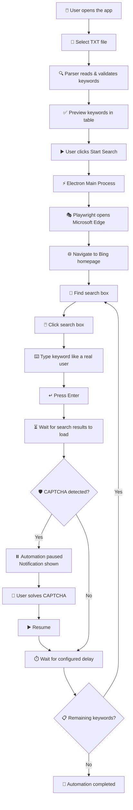
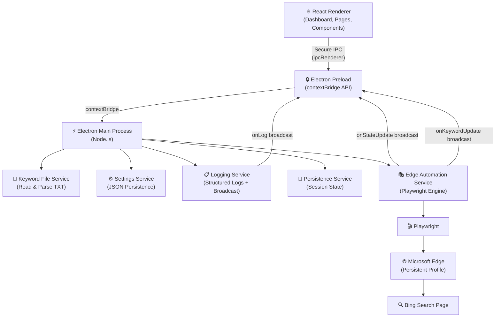
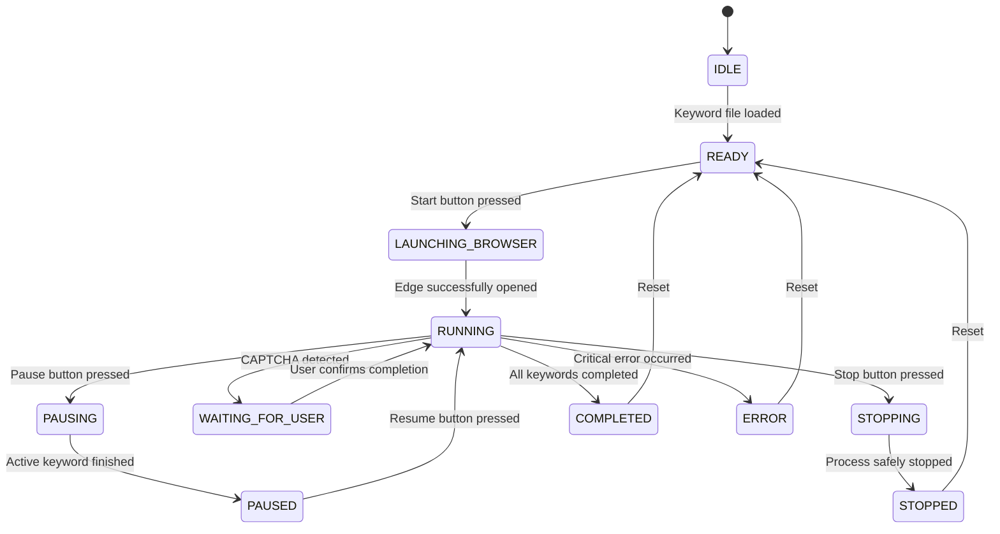

<div align="center">

# 🤖 Edge Search Automation Bot

**Automate Microsoft Edge searches from a single TXT file through a modern, secure, and easy-to-use desktop dashboard.**

---


---

**English 🇬🇧** | [Bahasa Indonesia 🇮🇩](README.id.md)

---

</div>

## 📋 Table of Contents

- [Overview](#-overview)
- [App Preview](#-app-preview)
- [Key Features](#-key-features)
- [How It Works](#-how-it-works)
- [App Architecture](#-app-architecture)
- [State Machine](#-state-machine)
- [Technologies Used](#-technologies-used)
- [TXT File Format](#-txt-file-format)
- [System Requirements](#-system-requirements)
- [Developer Installation](#-developer-installation)
- [How to Use](#-how-to-use)
- [Saving Edge Accounts](#-saving-edge-accounts)
- [Running Automation](#-running-automation)
- [Configuration](#-configuration)
- [Building Windows App](#-building-windows-app)
- [Folder Structure](#-folder-structure)
- [Security](#-security)
- [Error Handling](#-error-handling)
- [Troubleshooting](#-troubleshooting)
- [Activity Log](#-activity-log)
- [Roadmap](#-roadmap)
- [FAQ](#-faq)
- [Contribution](#-contribution)
- [Important Git Ignore](#-important-git-ignore-important)
- [Disclaimer](#️-disclaimer)
- [License](#-license)

---

## 📌 Overview

**Edge Search Automation Bot** is a Windows desktop application that reads a list of keywords from a TXT file, opens Microsoft Edge using a dedicated automation profile that preserves login sessions, and then types and performs searches one-by-one directly in the Bing search box — mimicking real user behavior.

### Problem Solved

Running dozens or hundreds of manual searches in Bing is tedious and time-consuming. Running terminal scripts requires technical knowledge that not all users possess. This application bridges both worlds: reliable browser automation with a simple, user-friendly desktop dashboard.

### Target Audience

- Users who want to automate a list of searches without writing code.
- Developers who need a search automation tool with a full dashboard.
- Teams using Microsoft accounts who want to maintain login sessions.

### Advantages Over Terminal Scripts

| Aspect | Terminal Script | Edge Search Automation Bot |
| --- | --- | --- |
| **Interface** | Text-only | Modern visual dashboard |
| **Account Login** | Manual every session | Saved automatically |
| **Progress** | Not visible | Real-time progress bar |
| **Control** | None | Pause / Resume / Stop |
| **Logs** | Plain text files | Colorized real-time activity log |
| **Error Handling** | Manual | Automatic retry + notification |
| **CAPTCHA** | Fails silently | Pauses + displays notification |
| **Users** | Developers only | Anyone |

> Searches are **not** performed by building URLs like `https://www.bing.com/search?q=keyword`. The bot opens the Bing homepage and types the keyword directly into the search box.

---

## 🖼️ App Preview

### Main Dashboard


### Keyword Manager


### Activity Log


### Settings


### Account Page


---

## ✨ Key Features

### Keyword Management

- [x] Read keywords from `.txt` files (one line = one keyword).
- [x] Preview and manage keywords in a table.
- [x] Add keywords manually.
- [x] Edit and delete keywords per row.
- [x] Duplicate detection with options to keep or delete.
- [x] Reload from the last loaded file.

### Automation

- [x] Open Microsoft Edge using a dedicated automation profile.
- [x] Login to Microsoft accounts only once — session is saved.
- [x] Automate directly through the Bing search input box.
- [x] Configurable typing speeds (Slow / Normal / Fast).
- [x] Configurable search delays (minimum 3 seconds).
- [x] Automatic retry per keyword on failure.
- [x] Fallback selector strategy for finding the search input.

### Monitoring & Controls

- [x] Start / Pause / Resume / Stop control buttons.
- [x] Animated real-time progress bar.
- [x] Active keyword display.
- [x] Statistics: Successes, Failures, Elapsed Time, ETA.
- [x] Real-time colorized activity log (INFO / SUCCESS / WARNING / ERROR).
- [x] CAPTCHA handling: Pauses automation and notifies user.

### Settings & Persistence

- [x] Auto-saved settings to disk.
- [x] Recovery from the last processed keyword position.
- [x] Light and Dark theme modes.
- [x] Export logs to `.txt` files.
- [x] Detection of manual browser closures.

### Build & Distribution

- [x] Build Windows installers (NSIS).
- [x] Build Portable `.exe` versions.

### Planned Features (Roadmap)

- [ ] Import from CSV and Excel.
- [ ] Support for multiple account profiles.
- [ ] Scheduled automation.
- [ ] Desktop notifications.
- [ ] System tray mode.
- [ ] Auto updates.

---

## ⚙️ How It Works



### Flow Explanation

1. **Open app** — Dashboard is shown with a *Ready* status.
2. **Select TXT file** — Keywords are read, validated, and loaded into the table.
3. **Login account** (once) — Edge opens, user logs in manually, session is preserved.
4. **Start search** — The bot executes each keyword sequentially:
   - Edge opens `https://www.bing.com/`
   - Bot locates the search input box using fallback selectors.
   - Bot clicks, clears the previous text, and types the new keyword.
   - Bot presses Enter and waits for the search results page.
   - Bot waits for the user-configured delay before proceeding to the next keyword.
5. **Monitoring** — Progress, logs, and statistics are updated in real-time.

---

## 🏗️ App Architecture



### Layer Responsibilities

| Layer | Responsibility |
| --- | --- |
| **React Renderer** | Dashboard UI, state management (Zustand), navigation, animations |
| **Electron Preload** | Expose restricted API to the renderer via `contextBridge` |
| **Electron Main Process** | Coordinates all backend services, sets up IPC handlers, manages window lifecycle |
| **Keyword File Service** | Reads TXT files, validates encoding, handles deduplication and cleaning |
| **Settings Service** | Loads and saves user preferences to a JSON file in `userData` |
| **Logging Service** | Formats structured logs, broadcasts to renderer, sanitizes sensitive info |
| **Persistence Service** | Saves and restores the last processed keyword position |
| **Edge Automation Service** | Controls Playwright, manages the state machine, retry logic, CAPTCHA detection |

> **Important:** Playwright and all browser automation code **only run in the Electron Main Process**. The React Renderer does not have direct access to Playwright, `fs`, or `child_process`.

---

## 🔄 State Machine

The automation service uses a state machine with 11 states:



| State | Description |
| --- | --- |
| `IDLE` | App is opened; no keywords loaded yet |
| `READY` | Keywords loaded; ready to start |
| `LAUNCHING_BROWSER` | Edge is currently being opened |
| `RUNNING` | Automation is actively running |
| `PAUSING` | Pause request received; finishing active keyword |
| `PAUSED` | Paused; waiting for resume command |
| `WAITING_FOR_USER` | CAPTCHA detected; waiting for manual user action |
| `STOPPING` | Stop request received |
| `STOPPED` | Safely stopped |
| `COMPLETED` | All keywords processed successfully |
| `ERROR` | A critical error has occurred |

---

## 🧰 Technologies Used

| Technology | Version | Function | Why Used |
| --- | --- | --- | --- |
| **Electron** | ^31 | Desktop application framework | Combines web UI with full Node.js access for automation |
| **React** | ^18.3 | UI Library | Builds an interactive, modular, and component-based dashboard |
| **TypeScript** | ^5.5 | Type safety | Reduces runtime errors and increases maintainability |
| **Vite** | ^5.4 | Build tool & dev server | Fast startup, instant HMR, and efficient builds |
| **electron-vite** | ^5.0 | Electron + Vite integration | Handles separate bundling for main, preload, and renderer processes |
| **Tailwind CSS** | ^4.0 | Utility-first CSS | Consistent design system, design tokens, and easy styling |
| **Playwright** | ^1.47 | Browser automation | Controls Microsoft Edge, finds elements, types, and manages sessions |
| **Microsoft Edge** | Latest | Target browser | Windows default browser with saveable Microsoft account sessions |
| **Framer Motion** | ^11.3 | UI Animations | Smooth page transitions, animated progress bars, and micro-interactions |
| **Lucide React** | ^0.435 | Icon library | Modern, lightweight, and consistent icons across the interface |
| **Zustand** | ^4.5 | State management | Lightweight state manager for automation state, settings, and logs |
| **electron-builder** | ^24.13 | Packaging | Packages the application into NSIS installers and Portable EXEs |
| **ESLint** | ^8.57 | Linting | Ensures quality and consistency of TypeScript and React code |
| **@electron-toolkit/preload** | ^3.0 | Preload helper | Simplifies contextBridge setup and IPC typing |
| **Node.js** | Runtime | JS Runtime | Runs the Electron main process, file system, and automation services |

### Crucial Architectural Note

**Electron IPC** is used as a secure communication channel between the React renderer and the Electron main process. All automation commands are sent via `ipcMain` and `ipcRenderer` instead of direct access.

**contextBridge** exposes a restricted API from the preload script to the renderer, ensuring the renderer cannot access Node.js modules like `fs` or `child_process`.

**Playwright** runs Microsoft Edge using:

```ts
channel: "msedge"
```

with `launchPersistentContext` so that login sessions are preserved between runs.

---

## 📄 TXT File Format

### Correct Format Example

```txt
cute cats
pet dogs
latest AI technology
business automation with AI
modern website design
how to learn English
tips to stay healthy
popular tourist places in Indonesia
```

### File Constraints

| Constraint | Detail |
| --- | --- |
| **Encoding** | UTF-8 |
| **Extension** | `.txt` |
| **One Line** | One keyword |
| **Empty Lines** | Skipped automatically |
| **Leading/Trailing Whitespace** | Automatically trimmed |
| **Spaces in Keywords** | Supported and typed as-is (`modern website design` ✓) |
| **Duplicates** | Can be kept or removed via prompt |
| **Empty Files** | Automation cannot be started |

A sample file is available at [`sample/pencarian.txt`](sample/pencarian.txt).

---

## 💻 System Requirements

| Component | Requirement |
| --- | --- |
| **Operating System** | Windows 10 (64-bit) or Windows 11 |
| **Node.js** | LTS Version (v18 or above recommended) |
| **npm** | Compatible version with Node.js |
| **Microsoft Edge** | Latest stable version |
| **RAM** | Minimum 4 GB, 8 GB recommended |
| **Internet Connection** | Active connection required for Bing searches |
| **Storage Space** | ~500 MB (including node_modules and browser profile) |

> **Note:** The application is currently only configured and packaged for **Windows x64**. Support for other platforms is not yet available.

---

## 🛠️ Developer Installation

### Clone and Install

```bash
# 1. Clone the repository
git clone <repository-url>
cd edge-search

# 2. Install all dependencies
npm install
```

### Running in Development Mode

```bash
npm run dev
```

Electron will open automatically with Hot Module Replacement (HMR) enabled. Code changes will reflect instantly without restarting.

### Other Commands

```bash
# Verify TypeScript types (renderer + main process)
npm run typecheck

# Lint code
npm run lint

# Lint with auto-fix
npm run lint:fix

# Preview production build
npm run preview
```

---

## 📖 How to Use

### Step 1: Account Login (Only Once)

1. Launch the application in dev mode with `npm run dev` (or run the installed app).
2. Click on the **Account** tab in the left sidebar.
3. Click the **"Login / Manage Edge Account"** button.
4. Microsoft Edge will open using a dedicated automation profile.
5. Manually log in to your Microsoft account.
6. Once logged in, **close Microsoft Edge** — the session will save automatically.
7. The status in the app will change to **"Account Saved"** ✓.

> You do not need to log in again unless you reset the automation profile or the session expires.

### Step 2: Load Keywords

1. Go to the **Keywords** tab in the sidebar.
2. Click **"Choose TXT File"** and select your keyword file.
3. If duplicates are found, select *Remove Duplicates* or *Keep All*.
4. The keyword table will display all keywords with their status.
5. Manually add, edit, or delete keywords as needed.

### Step 3: Configure Settings (Optional)

1. Go to the **Settings** tab.
2. Adjust search delay (minimum 3 seconds).
3. Select typing speed (Slow / Normal / Fast).
4. Set the maximum retry count for failed keywords.
5. Click **"Save Settings"**.

### Step 4: Start Automation

1. Return to the **Dashboard** tab.
2. Click the **"Start Search"** button.
3. Microsoft Edge will open and start performing searches automatically.
4. Track progress, active keywords, and statistics in real-time.

### Control Options During Execution

| Button | Function |
| --- | --- |
| **Pause** | Finish the active keyword, then stop before the next one |
| **Resume** | Continue automation from the next keyword |
| **Stop** | Stop automation safely and save the last position |

### Step 5: Monitor Activity Logs

- Click the **Activity Log** tab to view complete logging.
- Use **Copy Log** or **Save to TXT** to store the logs.

> **Important:** The app never asks for or stores your Microsoft account password. Autentication occurs entirely within Microsoft Edge.

---

## 🔑 Saving Edge Accounts

The application uses **Playwright Persistent Context** to save browser login sessions:

- Cookies and sessions are stored in a **special automation profile** separate from your main Edge profile.
- Passwords are never written to source code or configuration files.
- The profile is stored using `app.getPath("userData")` — Electron's secure user data directory.

**Profile Location (Conceptual):**

```text
%APPDATA%\edge-search-bot\edge-automation-profile\
```

### Important Notes

- The automation profile **cannot be shared** by two automation processes concurrently.
- Resetting the profile through the Account menu will **clear your login session** — you will need to log in again.
- The `edge-automation-profile/` directory should never be committed to git (it is ignored in `.gitignore`).

---

## 🤖 Running Automation

Once the **Start** button is clicked, the following happens behind the scenes:

```ts
// Illustration — actual implementation is in electron/services/edgeAutomationService.ts
for (const keyword of keywords) {
  // Navigate to Bing main page (not a direct search URL)
  await page.goto("https://www.bing.com/");

  // Locate search input box with fallback selectors
  const searchBox = await findSearchBox(page);

  // Clear previous query and type new keyword
  await searchBox.click();
  await searchBox.press("Control+A");
  await searchBox.press("Backspace");
  await searchBox.pressSequentially(keyword, { delay: typingDelay });
  await searchBox.press("Enter");

  // Wait for the search results page to load
  await waitForSearchResult(page);

  // Wait for the user-configured delay
  await sleep(configuredDelayMs);
}
```

> The code block above is a simplified workflow. The complete implementation containing retry logic, CAPTCHA detection, and state machine handles is in [`electron/services/edgeAutomationService.ts`](electron/services/edgeAutomationService.ts).

---

## ⚙️ Configuration

All settings can be changed in the **Settings** menu and are saved automatically.

| Setting | Default | Range | Description |
| --- | ---: | --- | --- |
| **Search Delay** | 5 seconds | 3–60 seconds | Delay before moving to the next keyword |
| **Page Timeout** | 30 seconds | 10–120 seconds | Time limit to wait for page load |
| **Typing Speed** | Normal (60ms) | Slow/Normal/Fast | Character-by-character typing delay |
| **Max Retries** | 2 times | 0–5 times | Retries before marking keyword as failed |
| **Post-Completion** | Keep open | — | Whether to close Edge or keep it open |
| **Resume Last Run** | Enabled | — | Resume from the last incomplete keyword |
| **Theme** | Dark | Dark/Light | Dashboard theme mode |

---

## 📦 Building Windows App

### Build Installer and Portable EXE

```bash
# Complete build: typechecks + compile + package for Windows
npm run dist
```

### Build Output

```text
dist/
├── Edge Search Automation Bot Setup 1.0.0.exe   ← NSIS Installer
└── Edge Search Automation Bot 1.0.0 Portable.exe ← Portable executable
```

### Pre-build Preparations

1. Prepare your icon file at `resources/icon.ico` (ICO format, min 256x256px).
2. Ensure no Electron process is running.
3. Run `npm run typecheck` beforehand to ensure zero TypeScript errors.

### Build Without Packaging (Development Testing)

```bash
# Compiles files without packaging the installer
npm run build
```

---

## 📁 Folder Structure

```text
edge-search/
├── electron/                          # Electron Main Process (Node.js)
│   ├── main.ts                        # Entry point — window lifecycle, IPC setup
│   ├── preload.ts                     # contextBridge API for renderer
│   ├── ipc/
│   │   ├── automationHandlers.ts      # IPC: bot controls (start/pause/stop)
│   │   ├── fileHandlers.ts            # IPC: read TXT files, save logs
│   │   └── settingsHandlers.ts        # IPC: load/save settings
│   └── services/
│       ├── edgeAutomationService.ts   # Core Playwright automation engine
│       ├── keywordFileService.ts      # Parse, validate, deduplicate keywords
│       ├── loggerService.ts           # Structured logging with broadcast
│       ├── settingsService.ts         # Settings persistence to JSON
│       └── persistenceService.ts      # Session persistence
│
├── src/                               # React Renderer Process
│   ├── types/
│   │   └── index.ts                   # Shared TypeScript interfaces
│   ├── stores/
│   │   ├── automationStore.ts         # Bot state, keywords, timer
│   │   ├── settingsStore.ts           # Settings state and persistence
│   │   └── logStore.ts                # Activity log state
│   ├── components/
│   │   ├── Sidebar.tsx                # Sidebar navigation
│   │   ├── TopBar.tsx                 # Header bar with statuses
│   │   ├── StatusBadge.tsx            # Colorized status badges
│   │   ├── ProgressBar.tsx            # Animated progress bar
│   │   ├── ControlButtons.tsx         # Start/Pause/Resume/Stop buttons
│   │   ├── CaptchaNotice.tsx          # CAPTCHA detection banner
│   │   ├── ConfirmDialog.tsx          # Dangerous action confirmation modal
│   │   └── AddKeywordDialog.tsx       # Keyword add/edit modal
│   ├── pages/
│   │   ├── DashboardPage.tsx          # Main dashboard page
│   │   ├── KeywordsPage.tsx           # Keyword manager table
│   │   ├── ActivityLogPage.tsx        # Real-time activity log viewer
│   │   ├── SettingsPage.tsx           # Application configurations
│   │   └── AccountPage.tsx            # Edge account manager page
│   ├── electron.d.ts                  # Global window.electronAPI types
│   ├── App.tsx                        # Root component + routing
│   ├── main.tsx                       # React entry point
│   └── index.css                      # Design system + Tailwind CSS v4
│
├── sample/
│   └── pencarian.txt                  # Sample keywords file
│
├── resources/
│   └── icon.ico                       # App icon (for builds)
│
├── scripts/
│   └── create-icon.js                 # Helper to create placeholder icon
│
├── electron.vite.config.ts            # electron-vite configuration
│   ├── vite.config.ts                 # Vite configuration (renderer)
│   ├── electron-builder.yml           # Windows packaging config
│   ├── tsconfig.json                  # TS config (renderer)
│   ├── tsconfig.main.json             # TS config (main process)
│   ├── tsconfig.node.json             # TS config (Node tools)
│   ├── .eslintrc.cjs                  # ESLint configuration
│   ├── .gitignore
│   ├── package.json
│   └── README.md
```

---

## 🔐 Security

Security and user privacy are core tenets of this application.

### Electron Configuration

```ts
webPreferences: {
  contextIsolation: true,   // Renderer and Node.js are isolated
  nodeIntegration: false,   // Renderer does not have direct Node access
  sandbox: false,           // Required for IPC contextBridge
  webSecurity: true,
}
```

### Applied Security Principles

- ✅ `contextIsolation: true` — Renderer cannot directly access Node.js API.
- ✅ `nodeIntegration: false` — No `require()` in renderer.
- ✅ Restricted API via `contextBridge` — Only required functions are exposed.
- ✅ All browser automation runs in the main process, not the renderer.
- ✅ Renderer has no access to `fs`, `child_process`, or `net`.
- ✅ Passwords are never requested, stored, or displayed.
- ✅ Cookies are not output to logs.
- ✅ Session and access tokens are never exported.
- ✅ All data is stored locally in `userData`.
- ✅ Profile resets require explicit user confirmation.
- ✅ No automatic CAPTCHA bypass mechanisms are implemented.
- ✅ No proxy rotation or fingerprint spoofing.
- ✅ No stealth plugins used to bypass third-party security.

> Use this application responsibly and ensure compliance with Microsoft's Terms of Service, Bing's Terms of Service, and your organization's policies.

---

## 🛡️ Error Handling

| Scenario | Application Action |
| --- | --- |
| **Microsoft Edge not installed** | Displays error message with installation instructions |
| **TXT file empty or invalid** | Automation cannot be started |
| **Search box not found** | Retries with fallback selectors, refreshes page |
| **Bing page load timeout** | Retries according to settings, marks failed when exhausted |
| **Internet connection lost** | Displays error, retries operation |
| **Browser closed manually** | Automation safely stops, status updates in UI |
| **Browser profile locked** | Displays error that profile is already in use |
| **CAPTCHA detected** | Pauses automation, displays banner, waits for user action |
| **All retries exhausted for keyword** | Marks keyword as **Failed**, moves to next keyword |

---

## 🔧 Troubleshooting

### Microsoft Edge doesn't open

- Verify that a stable version of Microsoft Edge is installed.
- Ensure no other automation processes are using the same profile concurrently.
- Try closing all existing Microsoft Edge windows and launch again.
- Check the **Activity Log** for detailed error messages.

### Account is not saved after login

- Always use the **"Login / Manage Edge Account"** button in the Account tab — do not open Edge manually.
- Close Edge using the window `×` close button when finished logging in.
- Verify that the `userData` folder is writable (not read-only).
- Do not manually delete the `edge-automation-profile` folder.

### TXT file fails to load

- Check that the file is saved with **UTF-8** encoding.
- Ensure the file has a `.txt` extension.
- Verify the file is not empty and has at least one line of keywords.
- Ensure each keyword is on a new line.

### Bing search box not found

Bing's interface updates occasionally. The application uses multiple fallback selectors. If this issue persists, the keyword will be marked **Failed**, and the bot will move to the next keyword. Check the Activity Log to see which selectors were attempted.

### Automation stopped by CAPTCHA

1. Solve the CAPTCHA manually in the active Edge browser window.
2. Return to the application dashboard.
3. Click **"I have resolved it"**.
4. Automation will automatically resume.

### Build EXE fails

**PowerShell:**

```powershell
# Delete cache and reinstall
Remove-Item -Recurse -Force node_modules
Remove-Item -Recurse -Force out
npm install
npm run build
npm run dist
```

**Command Prompt:**

```cmd
rmdir /s /q node_modules
rmdir /s /q out
npm install
npm run build
npm run dist
```

Verify that `resources/icon.ico` is present before running `npm run dist`.

---

## 📊 Activity Log

The activity log logs every step of the automation run in a structured, real-time format:

```text
[10:30:01] [INFO]    File pencarian.txt loaded successfully — 20 keywords found
[10:30:02] [INFO]    Starting automation from keyword 1
[10:30:05] [SUCCESS] Microsoft Edge successfully opened
[10:30:07] [INFO]    Searching: cute cats (1/20)
[10:30:11] [SUCCESS] Success: cute cats — 4.2s
[10:30:16] [INFO]    Searching: pet dogs (2/20)
[10:30:20] [SUCCESS] Success: pet dogs — 4.1s
[10:30:22] [WARNING] Search box not found, trying fallback selector...
[10:30:23] [INFO]    Fallback selector successfully resolved
[10:30:35] [ERROR]   Timeout — page did not load in 30 seconds
```

### Data NEVER Logged

- Passwords or credentials of any kind.
- Browser cookies or session tokens.
- Access tokens or refresh tokens.
- Any other sensitive session data.

---

## 🗺️ Roadmap

### Planned Enhancements

- [ ] Import keywords from CSV and Excel.
- [ ] Support for multiple account profiles.
- [ ] Scheduled automation (specific hours/days).
- [ ] Historical session statistics dashboard.
- [ ] Export search results to CSV.
- [ ] Support for multiple search engines.
- [ ] Auto-update mechanism.
- [ ] System tray mode (run in background).
- [ ] Desktop notifications (Windows Toast).
- [ ] Localization for English and Indonesian.
- [ ] Expanded unit and integration test coverage.
- [ ] Fully customizable Dark mode.

---

## ❓ FAQ

### Does the application store my Microsoft account password?

No. The application never asks for or stores passwords. Login occurs directly in Microsoft Edge, and the app uses a persistent browser profile to maintain the session.

### Do I have to log in every time I run automation?

No. As long as your session is valid and the automation profile is not reset or deleted, you only need to log in once.

### Does my main Edge browser have to be closed while running automation?

No. Your main Edge profile is not used — the app uses a separate dedicated automation profile. However, make sure no other automation processes are using the profile at the same time.

### Can keywords contain spaces?

Yes. Keywords like `business automation with AI` are fully supported and will be typed as-is.

### Can the app run without an internet connection?

The dashboard can be opened and used for keyword management. However, search automation requires an active internet connection to access Bing.

### Does the app bypass CAPTCHAs automatically?

No. When a CAPTCHA is detected, automation is paused, and the user must solve it manually. The app will wait for confirmation before resuming.

### Does the app support macOS or Linux?

Currently, no. Build configurations and packaging are only setup for **Windows x64**. Support for other platforms is not available.

### Where is the account profile data stored?

In Electron's `userData` folder, typically at:

```
%APPDATA%\edge-search-bot\edge-automation-profile\
```

This directory **must not be committed** to git and is included in `.gitignore`.

---

## 🤝 Contribution

Contributions are welcome! Here is the suggested workflow:

### Contribution Steps

1. **Fork** this repository.
2. **Create a branch** for your feature or bug fix:
   ```bash
   git checkout -b feature/your-feature-name
   # or
   git checkout -b fix/your-bug-name
   ```
3. **Write code** and ensure all checks pass:
   ```bash
   npm run typecheck
   npm run lint
   ```
4. **Commit** changes with descriptive messages:
   ```bash
   git commit -m "feat: add scheduling feature"
   git commit -m "fix: resolve search box detection delay"
   ```
5. **Push** your branch to your forked repository:
   ```bash
   git push origin feature/your-feature-name
   ```
6. **Create a Pull Request** with a clear description.

### Coding Guidelines

- Use strict TypeScript — no unnecessary `any` types.
- Run `npm run typecheck` and `npm run lint` before committing.
- Document complex logic.
- Keep the state machine consistent when adding new status flows.

### DO NOT COMMIT

```
❌ Folder edge-automation-profile/ or user-data/
❌ Credentials, tokens, or .env files with sensitive data
❌ Large build files (dist/, out/, release/)
❌ node_modules/
❌ Log files (*.log)
```

---

## 📋 Important Git Ignore

Ensure your `.gitignore` file contains the following entries:

```gitignore
# Dependencies
node_modules/

# Build output
dist/
dist-electron/
out/
release/

# Browser automation profile — DO NOT commit
edge-automation-profile/
edge-profile/

# Environment
.env
.env.*

# Log
*.log

# Testing
coverage/
playwright-report/
test-results/

# OS
.DS_Store
thumbs.db

# Cache
.vite/
```

---

## ⚠️ Disclaimer

This project is created to assist with search automation for **lawful, reasonable, and responsible use cases**. The user is solely responsible for ensuring usage complies with:

- Microsoft Edge Terms of Service
- Bing / Microsoft Bing Search Terms of Service
- Applicable Microsoft account policies
- Local laws and regulations

This application **does not** provide mechanisms to bypass CAPTCHAs, rate limits, authentication systems, or any security measures. Any usage violating third-party terms of service is at the user's own risk.

---

## 📜 License

This project is licensed under the [MIT License](LICENSE). Please see the LICENSE file for more information regarding usage rights and distribution.

---

<div align="center">

Built with ❤️ using **Electron**, **React**, **TypeScript**, and **Playwright**

⭐ If this project helped you, please consider starring the repository

</div>
